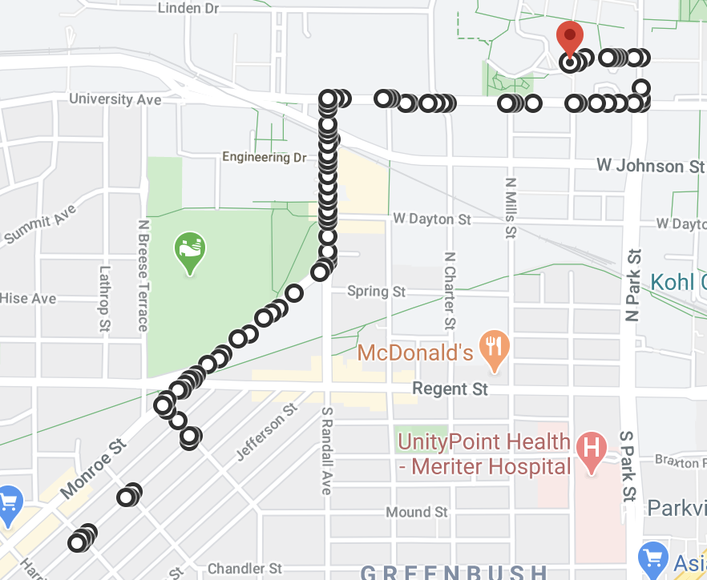

# GraphProject

The purpose of this project is to demonstrate the use of a graph data structure for efficient map navigation.

Note: Some parts of this project were adapted from https://github.com/udacity/CppND-Route-Planning-Project.  
Such as: Parsing and loading xml data into the graph, the route_model and model classes  
The main.cpp file and navigation class were developend by me.

To compile:
Create the build directory:  
`mkdir build && cd build`

Run CMake  
`cmake ..`

Build the project:  
`make`

Run the example:  
`./graph_navigation`

Follow the on screen prompts.
  
At the end of the application a distance and series of coordinates are printed.
  
To verify copy and paste the coordinate string into google as follows:  
`https://www.google.com/maps/dir/{paste coordinate string here}/@{pick a point pair to paste here},16z`  
replace the {} sections accordingly  

new map areas can be exported from Open Street Map https://www.openstreetmap.org/ the "map.osm" file should be placed in the upper directory of GraphProject.

Remaining areas of work on this project:
1. Implement walking directions
2. Integrate congestion feature, such as the way google does traffic
3. Draw the directions on an actual map. The Udacity project uses IO2D for drawing the map from the xml data
4. Plan 3 different routes to give the user options
